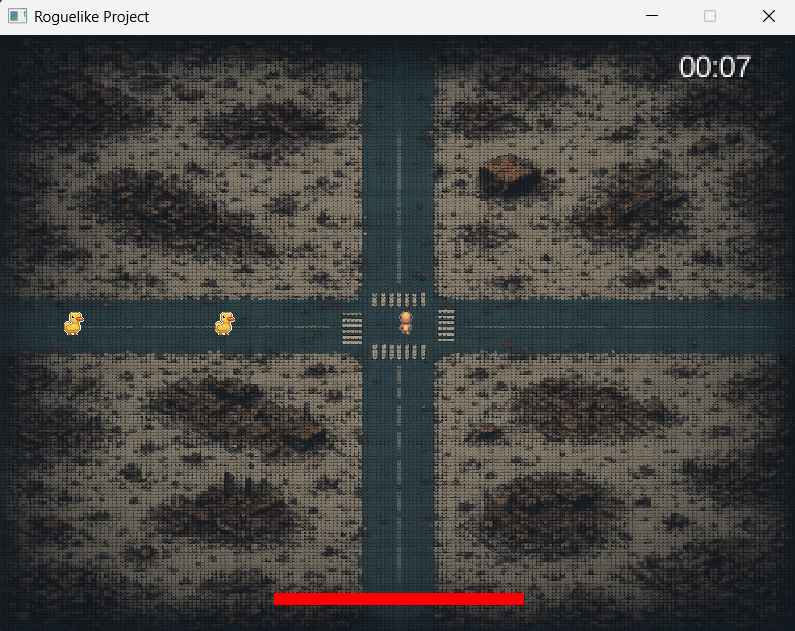
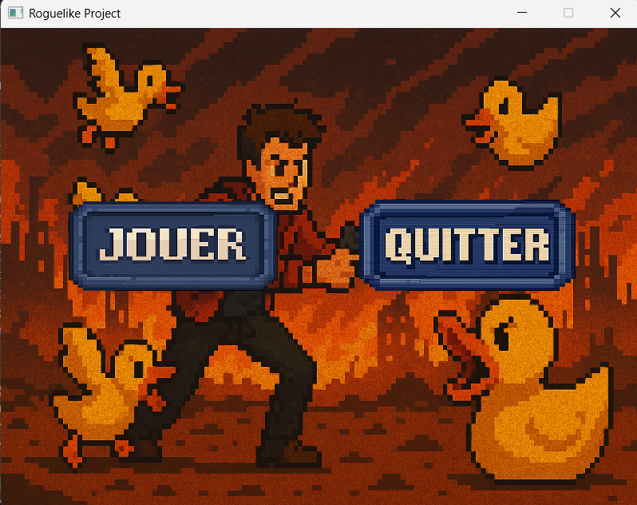
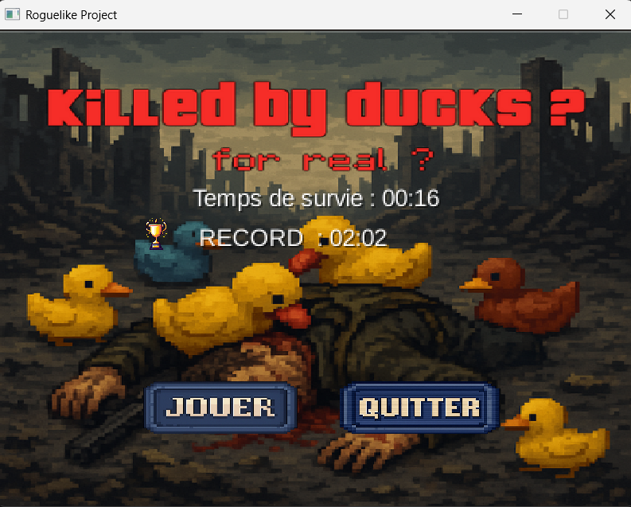

# 🕹️ Roguelike Survivor
> A 2D Roguelike Game developed in Java with LibGDX

[](https://www.oracle.com/java/) 
[](https://libgdx.com/) 
[](https://gradle.org/) 
[](#)
[](https://github.com/tonrepo/roguelike-survivor/issues)
[](https://github.com/tonrepo/roguelike-survivor/commits/main)

<details>
<summary>📑 Sommaire</summary>

- [Présentation du projet](#présentation-du-projet)
- [Lien entre théorie et pratique](#lien-entre-théorie-et-pratique)
- [Organisation mise en place](#organisation-mise-en-place)
- [Problèmes rencontrés & solutions trouvées](#problèmes-rencontrés--solutions-trouvées)
- [Points perfectibles & restes à faire](#points-perfectibles--restes-à-faire)
- [Points non solutionnés](#points-non-solutionnés)
- [Retours personnels sur le module](#retours-personnels-sur-le-module)
- [Perspectives d'évolution & Bilan](#perspectives-dévolution--bilan)

</details>

---

## 👥 Équipe projet

| Nom | Rôle | GitHub |
|:---|:---|:---|
| Lucas H | Chef de Projet | [@lucasHrd](https://github.com/lucasHrd) |
| Mehdi A | Développeur | [@Mwune](https://github.com/Mwune) |
| Ayoub A | Développeur | [@AmmaraAyoub](https://github.com/AmmaraAyoub) |
| Ibrahima B | Développeur | [@ibarry25](https://github.com/ibarry25) |
| Mohammed B | Développeur | [@Momobcm](https://github.com/Momobcm) |

## 🚀 Installation rapide

### Prérequis
- [Java 17](https://adoptium.net/)
- [Gradle](https://gradle.org/install/)

### Installation
1. Clonez le dépôt :
   ```bash
   git clone https://github.com/tonrepo/roguelike-survivor.git
   ```
   
2. Ouvrez le projet avec IntelliJ IDEA ou Eclipse.

3. Lancez la tâche run via Gradle.

➡️ Et c'est parti ! 🎮

---

## Présentation du projet

Dans le cadre de notre formation universitaire, nous avons réalisé un projet de développement de jeu vidéo en Java, en utilisant la bibliothèque LibGDX, spécialisée dans la création de jeux 2D.

**Objectifs du projet** :
- Concevoir un jeu complet, fonctionnel et structuré professionnellement.
- Appliquer les bonnes pratiques de programmation, gestion de projet et qualité logicielle à travers tests unitaires et d’intégration.

**Concept** :
Nous avons développé un **roguelike 2D**, dans lequel le joueur doit survivre à des vagues successives d'ennemis, récupérer des bonus, et affronter un boss final.

**Le gameplay repose sur** :
- La **survie** face à des vagues croissantes d'ennemis.
- La récupération de **boosts** (santé, vitesse, tir amélioré).
- L’affrontement d’un **boss final**.

**Focus** :
- Maîtrise des déplacements et tirs.
- Gestion des ressources (vie, boosts).
- Amélioration continue du score basé sur le temps de survie.
- Code propre, modulaire, scalable, robuste.

---
## 📸 Screenshots

| Gameplay | Menu | Ecran de Mort |
|:---:|:---:|:---:|
|  |  |  |


## 📝 Synthèse du projet

Ce projet représente une **expérience complète** : conception logicielle, développement agile, tests, collaboration avec Git, et gestion de projet en équipe.

---

## 📚 Lien entre théorie et pratique

Nous avons appliqué :
- Les **principes de conception objet** (responsabilités uniques, interfaces, encapsulation).
- **Les bonnes pratiques de clean code** (nommage clair, code modulaire, réutilisable).
- **La théorie de la gestion de projet agile** (itérations fréquentes, intégration continue).
- **Les stratégies de tests** (tests unitaires, tests d'intégration).

---

## 🛠️ Organisation mise en place

**Architecture par packages :**
- `entities/` : Joueur, ennemis, projectiles.
- `entities/items/` : Boosts modulables (santé, vitesse, projectiles).
- `managers/` : Gestionnaires de vagues et d'items.
- `screens/` : Menus, écran de jeu, écran de mort.
- `utils/` : Outils transversaux (Timer, Constants, Position...).
- `world/` : Carte du jeu.

**Organisation du cycle de jeu :**
- `update()` : Mise à jour de l’état du jeu.
- `render()` : Affichage visuel à chaque frame.

**Technologies utilisées :**
- Java 17
- LibGDX
- JUnit 5 + Mockito
- Git / Gradle

**➡ Cette organisation permet de** :

- Faciliter la lisibilité et la compréhension rapide du projet.

- Séparer clairement les responsabilités de chaque classe.

- Permettre l’évolutivité : ajouter de nouveaux éléments est simple et sans casser l’existant.

**Point de vue Gestion de Projet**
- Rédaction des objectifs et direction voulues en équipe.
- Brainstorming en équipes à chaque début de séances afin de constater de l'avancement et ou le groupe voulait aller.
- Fonctionnement de l'équipe avec un chef de projet attribuant les taches.
- 4 développeurs principaux, mais pouvant se relayer sur d'autres tâches en fonction de leur avancement dans les fonctionnalités leur étant attribuées.

---

## ⚠️ Problèmes rencontrés & solutions trouvées

| Problème | Solution mise en œuvre |
| :--- | :--- |
| Intégration tardive des boosts | Refactorisation du code pour intégrer un système d'objets modulable via interfaces (`ItemBase`). |
| Difficultés avec Git en équipe | Mise en place de règles Git simples (branches dédiées, pull requests, formation rapide) et "formation" de l'équipe en groupe. |
| Risque de collision de logique | Centralisation des constantes dans `Constants.java`, séparation stricte des responsabilités. |
| Tests compliqués sur certains comportements | Utilisation de **Mockito** pour simuler les comportements lors des tests. |
| Travail en équipe et repartition des taches complexe | Utilisation d'un tableau Kanban avec User Cases et criteres d'acceptations sur GitHub qui simplifie les choses|

---

## 📈 Points perfectibles & restes à faire

| Point à améliorer | Pourquoi ? |
| :--- | :--- |
| Gestion plus fine des collisions | Actuellement basée sur des rectangles simples (hitbox carrée). |
| Gestion avancée des ressources | Utiliser un **AssetManager** pour mieux gérer les textures. |
| Implémenter un système d’événements (EventBus) | Réduire les dépendances directes entre classes (moins de couplage). |
| Ajouter un système de progression par niveaux | Au lieu de vagues infinies uniquement. |
| Tests automatiques de rendu graphique | Pour détecter automatiquement les régressions visuelles. |
| Utilisation de Gradle compliqué, problèmes de build, portabilité et versions | Afin de pouvoir déployer le jeu plus facilement trouver une solution viable à 100% |

---

## 🚧 Points non solutionnés

- **Effets visuels** (explosions, particules, sons) : non intégrés faute de temps.
- **Sauvegarde de progression** : uniquement le meilleur score est sauvegardé.
- **Système multijoueur** : n’a pas été abordé pour ce projet.
- **Portabilité du jeu et déploiement** : Avec Gradle et les problèmes rencontrés, la portabilité du jeu sur tout pc est pas garantie.

---

## 🔥 Retours personnels sur le module

Ce projet a été **extrêmement formateur**.  
Nous avons concrètement expérimenté :

- La difficulté de **concevoir extensible dès le départ**.
- L’importance des **tests automatisés** pour éviter les régressions.
- La **gestion des priorités** : choisir quelles fonctionnalités développer selon le temps disponible.
- Le **travail collaboratif efficace** via Git, avec communication technique fluide.
- L’apprentissage par l'erreur : corriger des choix d'architecture quand de nouvelles fonctionnalités apparaissent.
- S'accorder unanimement sur un projet de groupe et mettre tout le monde d'accord / Travail en équipe


Plus au niveau des cours relatifs à la matière, le groupe, à l'unanimité les a trouver des enrichissant avec une vraie approche pédagogique et participative.
Ce qui nous a motivé à produire un projet à la hauteur ;)
(On adore visiblement les canards 🦆)

---

# 🚀 Perspectives d'évolution

- **Nouveaux types d'ennemis** et de **vagues dynamiques**.
- **Ajout d'effets visuels et sonores** pour améliorer l'immersion.
- **Système de quêtes** ou **compétences spéciales** pour enrichir le gameplay.
- **Version multijoueur** locale ou en ligne.
- **Déploiement sur mobile** en optimisant les performances.

(Ambition qui s'arrêtera à la fin de ses lignes mais ça fait stylé).

---

# 🎯 Bilan final

Nous sommes **fiers** du résultat final :
- Projet fonctionnel, fluide et structuré.
- Respect des standards professionnels.
- Solide base pour un développement ultérieur.

Cette expérience nous a fait **grandir techniquement** (architecture, tests, code propre) mais aussi **humainement** (gestion d’équipe, rigueur collaborative).

---

Merci d'avoir lu ! ⭐

🦆🦆
